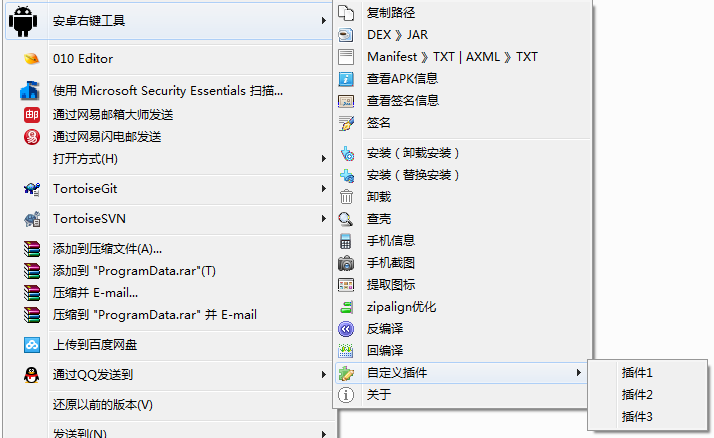
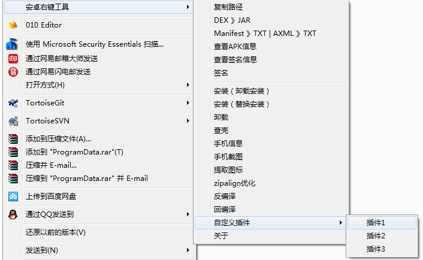

自定义系统右键菜单工具-使用说明

# 安装与卸载

- 安装：**以管理员身份运行**：install.bat

- 卸载：**以管理员身份运行**：uninstall.bat，由于是重启了explorer.exe，所以卸载后DLL文件可以直接删除。

# 设计模式

主要分为固定部分和可配置部分，固定部分主要是保持Windows Shell编程的透明，使用者无须关心右键的菜单如何创建、展示和响应的。

可配置部分主要是自定义菜单和菜单的响应事件。


# 自定义菜单配置

## 菜单配置文件示例
在bin目录下修改menu.xml，默认给出了一个模板：
```xml
<?xml version="1.0"?>
<menu name="安卓右键工具" icon="icon\logo.png" apptype="0" debug="0">
  <menu name="复制路径" icon="icon\copypath.png" tag="copypath"/>
  <menu name="DEX 》JAR" icon="icon\dex2jar.png" tag="dex2jar"/>
  <menu name="Manifest 》TXT | AXML 》TXT" icon="icon\m2txt.png" tag="axml2txt"/>
  <menu name="查看APK信息" icon="icon\apkinfo.png" tag="viewapk"/>
  <menu name="查看签名信息" icon="icon\signinfo.png" tag="viewsign"/>
  <menu name="签名" tag="sign" icon="icon\sign.png"/>
  <menu/>
  <menu name="安装（卸载安装）" icon="icon\install.png" tag="installd"/>
  <menu name="安装（替换安装）" icon="icon\installr.png" tag="installr"/>
  <menu name="卸载" icon="icon\uninstall.png" tag="uninstall"/>
  <menu name="查壳" icon="icon\detect.png" tag="viewwrapper"/>
  <menu name="手机信息" icon="icon\phone.png" tag="phone"/>
  <menu name="手机截图" icon="icon\photo.png" tag="photo"/>
  <menu name="提取图标" icon="icon\extracticon.png" tag="icon"/>
  <menu name="zipalign优化" icon="icon\align.png" tag="zipalign"/>
  <menu name="反编译" icon="icon\decom.png" tag="baksmali"/>
  <menu name="回编译" icon="icon\build.png" tag="smali"/>
  <menu name="自定义插件" icon="icon\plug.png">
    <menu name="插件1" tag="plug1"/>
    <menu name="插件2" tag="plug2"/>
    <menu name="插件3" tag="plug3"/>
  </menu>
  <menu name="关于" icon="icon\about.png" tag="about"/>
</menu>
```
## 根菜单说明

- **name**：显示在系统右键菜单中的名称。

- **icon**：可选，显示在系统右键菜单中的图标。

- **debug**：可选，默认为"0"。设置为 "1" 时可以通过**DebugView**查看日志输出，同时本目录下会生成名为 **log.txt** 的日志文件，方便排查：

  ```xml
  <menu name="安卓右键工具" icon="icon\logo.png" debug="1">
      ...
  </menu>
  ```

  

- **apptype**：可选，表示用户点击了子菜单命令后需要调用的三方App类型，主要有以下可选值：

  - "0"：默认，调用本目录下名为 **oncommand.exe** 的程序：

    ```xml
    <menu name="安卓右键工具" icon="icon\logo.png">
        ...
    </menu>
    ```

    调用的参数序列为：**oncommand.exe tag file [files]**

    

  - "1"：调用本目录下名为 **runlua.exe** 的程序，需要实现本目录下的 **oncommand.lua** 脚本文件：

    ```xml
    <menu name="安卓右键工具" icon="icon\logo.png" apptype="1">
        ...
    </menu>
    ```

    调用的参数序列为：**runlua.exe oncommand.lua tag file [files]**

    

  - "3"：调用Python脚本，需要实现本目录下的 **oncommand.py** 脚本文件：

    ```xml
    <menu name="安卓右键工具" icon="icon\logo.png" apptype="3">
        ...
    </menu>
    ```

    调用的参数序列为：调用的参数序列为：**runlua.exe oncommand.lua tag file [files]**

    

## 子菜单说明

- 一个菜单项三个属性，分别为**name**，**icon**和**tag**。
- 如果name为空，则该菜单项为分隔条，例如配置分隔条可以这样配置：

```
<menu/>
```

- icon指示了菜单项的图标文件，以相对路径填写，相对于DLL的所在目录。例如：icon\logo.png，若不填写或者指示的图标文件不存在或者加载失败，则条菜单项前面不会出现图标，问题不大。为了加快菜单的加载速度，也可以全部不配置图标文件。
- tag：如果该项菜单没有子菜单，也不是分隔条，那么就要响应事件，则tag指示了响应的事件名称，最终会被传递到三方程序中。
- 如果菜单含有子菜单项，则按示例menu.xml添加即可。最多支持二级菜单项，不支持更深层次的子菜单。

## 效果截图





## 如何响应事件

点击任意菜单项后，菜单的tag名称和选择的文件会被传递到三方App中，传递的参数形式为：

```
App tag file [files]
```
如果用户只选择了一个文件，则参数形式为：
```
App tag file
```
如果用户只选择了多个文件，则参数形式为：
```
App tag file files
```
也即出现开关files，也可以认为多了一个参数标志。当出现这个标志时，file是一个纯文本的文件全路径，内容是用户选择的多个文件列表，逐行列出。


具体调用哪个App取决于菜单配置文件中根菜单的**apptype**值，可以参考前面的章节以及目录下的示例脚本。


## 注意

- menu.xml配置文件需要utf-8格式
- 选择多文件时生成的临时文件是utf-8格式的
- 日志文件是utf-8格式的


# 更新日志

#### 2020年7月28日

- 在 **CustomContextMenu.dll** 同目录下如果出现与菜单中 tag 同名的 Python 文件，则也会调用。例如某子菜单项的 tag 为 decodeFile，且在同目录下存在 decodeFile.py，则右键的时候会调用本地安装的 Python 执行该文件，传递的参数就是右键选中的文件路径，多文件选中时规则同前面章节。

#### 2020年6月1日

- 增加 **debug** 调试开关，开关打开时有日志输出且三方调用不隐藏窗口，方便排错
- 增加 **apptype** 选项，使得响应事件的三方可以是exe、Lua脚本、Python脚本